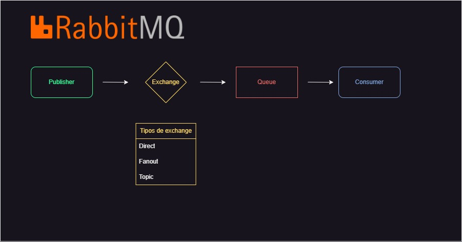

# Esse repositório serve como base de estudo sobre fundamentos de RabbitMQ

- Vou falar sobre publisher, exchange, queue e consumer

- Após o Estudo inicial vou criar um pequeno projeto em rails somente para colocar em prática toda a teoria do estudo sobre RabbitMQ.

- Segue imagem base do funcionamento do RabbitMQ.



# Chat utilizando RabbitMQ

Este projeto consiste em duas aplicações Rails API (`person_1` e `person_2`) que se comunicam entre si utilizando RabbitMQ localmente . O objetivo é criar um chat simples para aprender a usar RabbitMQ.

## Pré-requisitos

- **Ruby**: 3.1.0
- **Rails**: 7.0.8
- **RabbiMQ**

## Clonando o Repositório

Clone o repositório para sua máquina local:

```sh
git clone https://github.com/GuiMarcelino/RabbitMQ_Study
```

## Configuração das Aplicações

- **Configurar person_1:** Navegue até o diretório person_1 e instale as dependências:
```sh
cd person_1
bundle install
```

- **Configurar person_2:** Navegue até o diretório person_2 e instale as dependências:
```sh
cd person_2
bundle install
```

# Executando projeto local

## Subir server RabbitMQ local
```sh
sudo systemctl restart rabbitmq-server
```
## Subindo servidor das Aplicações
- person_1
```sh
cd ~/my_projects/RabbitMQ_Study/person_1
rails s -p 3001 -b 0.0.0.0
```

- person_2
```sh
cd ~/my_projects/RabbitMQ_Study/person_2
rails s -p 3002 -b 0.0.0.0
```

## Criando comunicação

- person_1
```sh
cd ~/my_projects/RabbitMQ_Study/person_1
ruby send_message_interactive.rb person_1 person_1
```

- person_2
```sh
cd ~/my_projects/RabbitMQ_Study/person_2
ruby send_message_interactive.rb person_1 person_2
```
