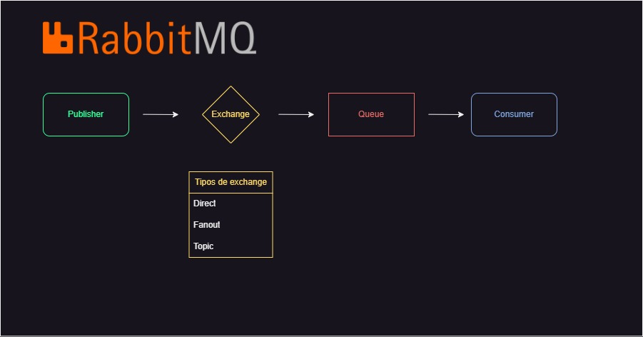

# O que é RabbitMQ?

**RabbitMQ** é um broker de mensagens open-source que facilita a comunicação entre componentes de software de forma eficiente, desacoplada e escalável. É implementado no protocolo AMQP (Advanced Message Queuing Protocol), mas também suporta outros protocolos como MQTT, STOMP, entre outros.

# Por que usar RabbitMQ?

- **Desacoplar componentes de aplicação:** Os componentes podem operar de forma independente, comunicando-se através de mensagens.

- **Balanceamento de carga:** Distribui as mensagens entre os consumidores e processos, ajudando a balancear a carga e a otimizar o uso de recursos.

- **Resiliência e escalabilidade:** Pode ser configurado para garantir que as mensagens não se percam em caso de falhas de hardware ou software, e é fácil de escalar para lidar com mais carga conforme necessário.

- **Padronização de comunicação:** Oferece uma forma padronizada de mensagens entre diferentes linguagens e plataformas.

# Principais Componentes do RabbitMQ

- **Producer:** Aplicação que envia as mensagens.

- **Queue:** Local onde as mensagens são armazenadas até serem consumidas.

- **Consumer:** Aplicação que recebe e processa as mensagens.

- **Exchange:** Decide para qual queue a mensagem deve ir, baseado em regras definidas (bindings).

# Exemplo Prático de Uso

Imagine um e-commerce como pedidos, pagamentos e envios. Quando um cliente faz um pedido, o serviço de pedidos envia uma mensagem para o RabbitMQ, que então encaminha essa mensagem para outros serviços como pagamentos e envio. Cada serviço deve processar a sua parte de forma independente.

